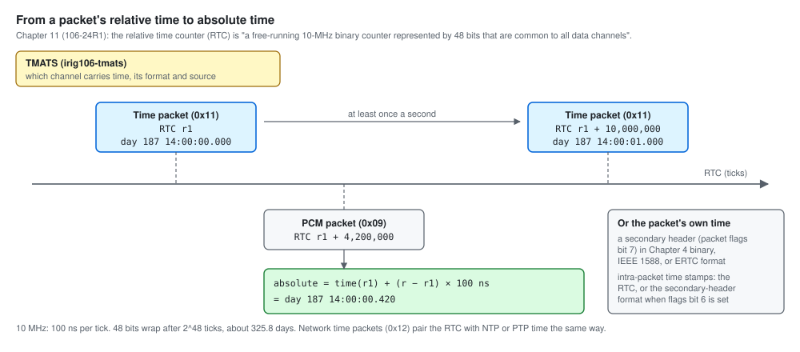
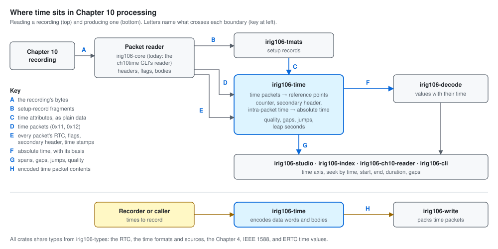
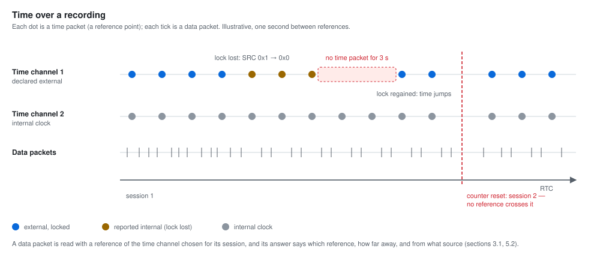

# What time processing gives Chapter 10 processing

> **Status: design draft, written one section at a time for the owner's
> review.** The contract document for `irig106-time`, in the shape of
> `irig106-tmats`'s `docs/TMATS-IN-CHAPTER-10.md`, as the ecosystem coverage
> map requires (`irig106-docs`, `src/coverage.md`: `irig106-time` next).
> Every rule and quotation is taken from the archived standard
> (`TelemetryWorks/rcc-106-standards`; baseline 106-24R1) and cited. Where
> the crate disagrees with the standard today, `docs/STANDARD-REVIEW.md`
> records it (T-1 to T-11); this document describes what the crate should
> give, and section 8 plans the changes.

## Contents

| Section | Status |
|---------|--------|
| 1. What `irig106-time` is for | **draft for review** |
| 2. Where time sits in Chapter 10 processing | **draft for review** |
| 3. What the crate answers, question by question | **draft for review** |
| 4. Contracts per consumer | **draft for review** |
| 5. Time over a recording | **draft for review** |
| 6. When time is missing, wrong, or disagrees | to be written |
| 7. A worked example | to be written |
| 8. What changes as a result | to be written |

---

## 1. What `irig106-time` is for

### 1.1 The problem: packets carry relative time, not absolute time

Every packet header carries a **relative time counter** (RTC): "a
free-running 10-MHz binary counter represented by 48 bits that are common
to all data channels. The counter shall be derived from a 10-MHz internal
crystal oscillator and shall remain free-running during each session (e.g.,
recording)" (Chapter 11 §11.2.1.1 i, 106-24R1). It orders packets across
channels to 100 ns, but it says nothing about the date or the time of day,
and after 2^48 ticks — about 325.8 days — it wraps.

Absolute time arrives in other places:

- **Time packets.** "Time is treated like another data channel"
  (§11.2.3.2). A Format 1 time packet (data type `0x11`, "IRIG/GPS/RTC")
  carries a time in binary-coded decimal — day of year, or day, month, and
  year — with its source and format in the channel-specific data word, and
  "will be generated at a minimum frequency of 1 hertz". A Format 2 packet
  (`0x12`, "Network Time") carries NTP time ("referenced in UTC time with an
  epoch of January 1, 1900. The NTP time includes leap seconds") or PTP time
  ("referenced in International Atomic Time with an epoch of January 1, 1970.
  The PTP time does not include leap seconds") (§11.2.3.3). Each time packet's
  header RTC pairs that absolute time with the counter.
- **A time packet comes first.** "A time data packet shall be the first
  dynamic data packet at the start of each session. Only static
  Computer-Generated Data, Format 1 packets may precede the first time data
  packet" (§11.2.3.2).
- **Some packets carry their own time.** A packet with a secondary header
  (packet flags bit 7) carries a 64-bit time in Chapter 4 binary, IEEE 1588,
  or extended RTC (ERTC, "1-nanosecond resolution … derived from a
  free-running 1-gigahertz (GHz) clock", with "RTC = ERTC/100") format; its
  intra-packet time stamps are the RTC, or that format when packet flags bit
  6 is set (§11.2.1.1 g, §11.2.1.2, §11.2.1.3 b).
- **TMATS says where time is.** The setup record declares which channels
  carry time (`R-x\CDT-n` = TIMEIN), their packet format (`R-x\TTF-n`), time
  format (`R-x\TFMT-n`), and time source (`R-x\TSRC-n`), each channel's
  secondary-header time format (`R-x\SHTF-n`), and the measurements that are
  time words inside data (`C-d\DCT` = PTM, NTM, BTM) — `irig106-tmats`
  `docs/TMATS-IN-CHAPTER-10.md` section 3.8.

*Correlation.* Time packets pair counter values with absolute time at least
once a second; a data packet's counter value becomes absolute time from the
nearest time packet — its time plus the counter difference at 100 ns per
tick. A packet with a secondary header may carry its own time instead. TMATS
says which channel carries time and in what format.

### 1.2 What `irig106-time` does

**`irig106-time` is the one place in the ecosystem where time is
understood**: it turns counters, time packets, and packet time stamps into
absolute time, and says how good that time is. It is a `no_std` library
(`src/lib.rs`) that works on bytes and values its callers supply.

| Area | What the crate does | Where today |
|------|---------------------|-------------|
| Relative time | The 48-bit RTC: from its 6 bytes, wrap-safe differences, nanoseconds | `Rtc` (from `irig106-types`) |
| Time packets | Format 1: the channel-specific data word and the day-of-year and day-month-year bodies, read and written; Format 2: the channel-specific data word, NTP and PTP bodies | `csdw`, `bcd`, `network_time` (T-2, T-3, T-7) |
| Packet time | The secondary header (with its checksum) and intra-packet time stamps, in Chapter 4 binary, IEEE 1588, and ERTC formats | `secondary`, `intra_packet`, `absolute` (T-1, T-5, T-10) |
| Correlation | Absolute time for any RTC from reference points — per channel, nearest reference, time jumps, RTC resets, drift, out-of-order packets — and a streaming form with bounded memory | `correlation`, `streaming` |
| Quality | A measure of how trustworthy the correlation is | `quality` |
| Leap seconds | The TAI–UTC offset, from a built-in table the caller can extend | `network_time` |
| Edition | The edition declared by the setup record's CSDW | `version` (T-9; moving to `irig106-types`) |
| Recording events | Recording event types | `recording_event` (T-8: whether they belong here is open) |

### 1.3 What it deliberately does not do

| Not done here | Done by | Why |
|---------------|---------|-----|
| Open files; walk packets | the caller — `irig106-core` when it exists; this repository's own `ch10time` CLI has a reader | The library works on bytes it is given |
| Read TMATS | `irig106-tmats`, which hands over the time attributes as plain data | One place understands the setup record (`irig106-tmats` ADR-0030) |
| Extract time words from PCM or bus data | `irig106-decode`, which finds the words; turning a Chapter 4 time word into absolute time is this crate's (section 3) | Data decoding belongs to the decoder |
| Write packets | `irig106-write`; this crate encodes time packet bodies | The library does not assemble packets |
| Present time | the tools | — |

### 1.4 Who relies on it

| Consumer | What it needs from time processing |
|----------|-----------------------------------|
| `irig106-decode` | Absolute time for every packet and, through intra-packet time stamps, for every message or sample |
| `irig106-studio` | A time axis: absolute time for anything shown |
| `irig106-index` | Seeking by time; the time span of each part of a recording |
| `irig106-ch10-reader`, `irig106-cli` | A recording's start, end, and duration; time gaps and jumps |
| `irig106-write` | Time packet bodies and channel-specific data words to write |
| `irig106-tmats` | Nothing at run time; the configuration timeline relates setup records to relative time on its own (`irig106-tmats` L1-CH10-008) |

Section 4 turns each row into a contract.

### 1.5 Promises the crate makes today

From its own documents and code:

1. **No panics on bad input**: "The crate shall return typed errors for all
   fallible operations; it shall not panic on invalid input data"
   (L1-ERR-001).
2. **Nanosecond precision**: "at least nanosecond precision to support all
   Chapter 10 time formats" (L1-ABS-001).
3. **`no_std`**, with `std`, `serde`, and `chrono` as options; every public
   item documented (`#![deny(missing_docs)]`).
4. **WebAssembly**: CI builds the crate for `wasm32` with and without
   `serde`.
5. **One dependency**: `irig106-types`, for the shared types.

Section 8 proposes what the ecosystem's other crates promise and this one
does not yet state — for example, that every absolute time says which
reference and which source it came from.

### 1.6 Questions for the next sections

- **Several time sources.** A recording may carry more than one time
  channel, and a time packet's source can change while recording ("If the
  time source is external (0x1) and lock on the external source is lost then
  the time source shall indicate Internal (0x0)", §11.2.3.2). Which reference
  governs a packet, and how the caller chooses (L1-COR-003), is for sections
  3 and 5.
- **TMATS and the packets say the same things differently.** TMATS writes
  the time format and source as letters (`R-x\TFMT-n`: A, B, G, I, N, U, X,
  0, 1, 2; `R-x\TSRC-n`: I, E, R, X); the time packet's data word carries
  numbers (FMT `0x0` IRIG-B … `0xF` NONE; SRC `0x0` internal … `0xF` none;
  NTF for network time). And TMATS names secondary-header time format 0
  "Chapter 4 BCD" where the packet flags define `00` as "Chapter 4 binary
  weighted 48-bit time format" (Chapter 4 §4.7 allows both weightings for
  time words in a PCM stream). Section 6 reconciles them.
- **Recording events.** Their meaning comes from the setup record's event
  definitions (T-8); whether they belong in this crate, in `irig106-core`, or
  with `irig106-tmats` is open.
- **Time inside data.** PCM, network, and 1553 time words (Chapter 4 §4.7;
  `C-d\PTM`, `NTM`, `BTM`) are found by `irig106-decode`; section 3 decides
  what this crate offers to turn them into absolute time.
- **Leap seconds.** NTP includes them and PTP does not; the table must stay
  current and say how current it is.
- **The findings of `docs/STANDARD-REVIEW.md`** (T-1 to T-11), the stale
  citations to Chapter 10 section numbers from before 106-17, and RCC 200's
  absence from the standards archive are planned in section 8.

---

## 2. Where time sits in Chapter 10 processing

*Two directions.* Reading a recording (top): the packet reader hands
setup-record fragments to `irig106-tmats`, which gives this crate the time
attributes as plain data; time packets become reference points; every
other packet's counter, secondary-header time, and time stamps become
absolute time for the decoder and the tools. Producing a recording
(bottom): this crate encodes what a time packet carries, and
`irig106-write` packs it. Letters name what crosses each boundary (2.3).

### 2.1 Reading a recording

1. **The packet reader walks the file** (A): each header, with its relative
   time counter and packet flags, the secondary header when flags bit 7 is
   set (its checksum verified), and the body (Chapter 11 §11.2.1). Today this
   repository's `ch10time` CLI has its own reader; `irig106-core` takes that
   over when it exists.
2. **The setup record says where time is** (B, C). `irig106-tmats` reads it
   and hands this crate, as plain data, the time channels (`R-x\CDT-n` =
   TIMEIN) with their packet format, time format, and time source
   (`R-x\TTF-n`, `R-x\TFMT-n`, `R-x\TSRC-n`), each channel's secondary-header
   time format (`R-x\SHTF-n`), and the recording-format version the setup
   record declares (`irig106-tmats` `docs/TMATS-IN-CHAPTER-10.md` sections
   3.8 and 3.9).
3. **Time packets become reference points** (D). Each time packet (`0x11`,
   `0x12`) pairs its header counter with the absolute time in its body; the
   correlator keeps these per time channel (`TimeCorrelator::add_reference`,
   `add_reference_f2`). Because "A time data packet shall be the first
   dynamic data packet at the start of each session" (§11.2.3.2), a reference
   exists before the first data packet.
4. **Every other packet's time is resolved** (E, F). A packet's counter
   becomes absolute time from the references (`correlate`); a packet with a
   secondary header carries its own time, in the format of packet flags bits
   3–2; intra-packet time stamps sit inside packet bodies, whose layout
   depends on the data type, so `irig106-decode` finds them and asks this
   crate to turn them into absolute time — the counter's, or the
   secondary-header format's when packet flags bit 6 is set (§11.2.1.1 g,
   §11.2.1.3 b).
5. **Tools present time** (G): the time axis, the recording's start, end,
   and duration, gaps and jumps in time, and how trustworthy it is.

**Which reference?** When a recording carries several time channels, or a
time source loses and regains lock, more than one set of references
exists; the caller names a time channel or lets the correlator use the
nearest reference (`correlate(rtc, channel)`). Sections 3 and 5 define the
choice.

### 2.2 Producing a recording

A recorder, or a tool writing a recording, knows the times to record; this
crate encodes the time packet's channel-specific data word and body —
Format 1 in day-of-year or day-month-year form, Format 2 with NTP or PTP time
— and `irig106-write` packs them into packets (H). The counter itself comes
from the recorder's clock, not from this crate.

### 2.3 What crosses each boundary

| | From → to | What crosses |
|---|-----------|--------------|
| A | recording → packet reader | the file's bytes |
| B | packet reader → `irig106-tmats` | setup-record fragments with their provenance |
| C | `irig106-tmats` → `irig106-time` | the time attributes: time channels with packet format, time format, and time source; each channel's secondary-header time format; the recording-format version declared; which setup record governs which packets |
| D | packet reader → `irig106-time` | each time packet: channel ID, data type, header counter, and the channel-specific data word and body |
| E | packet reader or `irig106-decode` → `irig106-time` | a packet's counter and flags, its secondary header, and its intra-packet time stamps (found by the decoder) |
| F | `irig106-time` → `irig106-decode` | absolute time for a counter or a time stamp, with its basis — which reference, which time channel, which source (section 3) |
| G | `irig106-time` → the tools | time spans, gaps, jumps, RTC resets, drift, and quality |
| H | `irig106-time` → `irig106-write` | encoded channel-specific data words and time packet bodies |

Every boundary carries bytes and plain values, never files. Shared types —
the counter, the time formats and sources, the Chapter 4, IEEE 1588, and
ERTC time values — come from `irig106-types`.

### 2.4 Which crate depends on which

| Crate | Depends on | Does not depend on |
|-------|-----------|--------------------|
| `irig106-time` | `irig106-types` | `irig106-tmats`, `irig106-core`, `irig106-decode` |
| `irig106-tmats` | `irig106-types` | `irig106-time` (the configuration timeline works in counter values) |
| `irig106-decode` | `irig106-types`, `irig106-tmats`, `irig106-time` | — |

This crate receives everything it needs as plain data (C, D, E), the same
arrangement `irig106-tmats` ADR-0030 chose for `irig106-core`, so it stays a
small leaf library that any tool — or a browser build — can use alone.
**Decided (owner, 2026-09-26): `irig106-decode` depends on
`irig106-time`**, so that it turns the time stamps and time words it finds
into absolute time itself, rather than each tool joining the two. This
crate brings no other dependency with it.

---

## 3. What the crate answers, question by question

Each subsection takes one question a consumer asks, cites the standard
(106-24R1 Chapter 11 unless stated), names what the crate provides today,
and notes where `docs/STANDARD-REVIEW.md` found it wrong. Readings of the
standard that need the owner's decision are marked **proposed** and
gathered in section 8.

### 3.1 What absolute time does a counter value mean?

The counter is "a free-running 10-MHz binary counter represented by 48 bits
that are common to all data channels" (§11.2.1.1 i): 100 ns a tick, the same
clock for every channel, wrapping after about 325.8 days.

**Today:** `TimeCorrelator::correlate(rtc, channel)` finds the nearest
reference point — of the named time channel, or of any — and adds or
subtracts the counter difference at 100 ns a tick (`src/correlation.rs`);
`StreamingTimeCorrelator` does the same with bounded memory. Counter
differences are wrap-safe (`Rtc::elapsed_ticks`).

**What the answer should carry (proposed):** the absolute time **and its
basis** — the reference point used (its time channel, counter, and time),
how far the counter is from it, whether it lies between two references or
beyond the last, and the time source and format of that reference. A time
100 ms from a reference and one an hour past the last reference are not
equally good; today both come back as a bare time.

### 3.2 What does a Format 1 time packet say?

| Field | Where | Values |
|-------|-------|--------|
| Time source (SRC) | data word bits 3–0 | `0x0` internal, `0x1` external, `0x2` internal from RMM, `0x3`–`0xE` reserved, `0xF` none (T-6) |
| Time format (FMT) | bits 7–4 | `0x0` IRIG-B, `0x1` IRIG-A, `0x2` IRIG-G, `0x3` real-time clock, `0x4` UTC from GPS, `0x5` native GPS, `0x6`–`0xE` reserved, `0xF` "NONE (time packet payload invalid)" (T-7) |
| Leap year | bit 8 | whether this is a leap year |
| Date format | bit 9 | day of year (Figure 11-13), or day, month, and year (Figure 11-14) |
| IRIG time source (ITS) | bits 15–12 | for an internal IRIG time code generator: freewheeling (with no source, from `.TIME`, from RMM time), or locked to external IRIG, GPS, NTP, PTP, or embedded time (T-7) |
| Reserved | bits 31–16, 11–10 | zero |
| Body | after the data word | binary-coded decimal: tens and hundreds of milliseconds, seconds, minutes, hours, and days — plus months and years in the second form (Table 11-16) |

The body resolves 10 ms. For IRIG formats the counter is captured "IAW
IRIG 200"; for others "consistent with the resolution with the time packet
body format (10 milliseconds [ms] as measured by the 10-MHz RTC)"
(§11.2.3.2). "If the time source is external (0x1) and lock on the external
source is lost then the time source shall indicate Internal (0x0)."

**Today:** `TimeF1Csdw`, `DayFormatTime`, `DmyFormatTime` read and write
these, with digit and reserved-bit checks — without ITS or FMT `0xF`, and
with a source value 3 the standard reserves (T-6, T-7).

**The year.** The day-of-year form carries no year. The crate leaves it
unset (`AbsoluteTime` holds an optional year); where the year comes from
when it is needed — a day-month-year packet, the caller, or the setup
record — is for section 5.

### 3.3 What does a Format 2 time packet say?

| Field | Where | Values |
|-------|-------|--------|
| Network time format (NTF) | data word bits 7–4 | `0x0` NTP version 3, `0x1` IEEE 1588-2002, `0x2` IEEE 1588-2008 (T-2) |
| Time status (TS) | bits 3–0 | `0x0` time not valid, `0x1` time valid (T-2) |
| NTP body | two 32-bit words | seconds and fractions of a second since 1900-01-01, UTC, leap seconds included |
| PTP body | two 32-bit words | seconds and nanoseconds since 1970-01-01, TAI, no leap seconds (T-3) |

The packet "will be generated at a minimum frequency of 1 hertz unless it
is recorded at the raw network rate of the NTP or PTP frames" (§11.2.3.3);
it exists from 106-17 (T-4).

**Today:** `TimeF2Csdw`, `NtpTime`, `PtpTime`, `parse_time_f2_payload`, and a
`LeapSecondTable` for TAI–UTC — with the data word read from the wrong bits
and the PTP body as 10 bytes (T-2, T-3). A time marked "not valid" must not
become a reference silently (section 6).

### 3.4 What time does a packet carry itself?

- **Secondary header** (packet flags bit 7; §11.2.1.2): 8 bytes of time, 2
  reserved, and a checksum, in the format of packet flags bits 3–2: `00`
  "Chapter 4 binary weighted 48-bit time format" (its two low bytes zero),
  `01` IEEE 1588 (seconds and nanoseconds), `10` ERTC ("1-nanosecond
  resolution", "RTC = ERTC/100"), `11` reserved. "The secondary header can be
  enabled on a channel-by-channel basis but all channels that have a
  secondary header must use the same time source in bits 2-3 of the packet
  flags." The time applies to "the first bit of the data in the packet body
  (unless it is defined in each data type section)".
- **Intra-packet time stamps** (§11.2.1.3 b): 8 bytes, "time in either 48-bit
  RTC format (plus 16 high-order zero bits) or 64-bit format as specified in
  the packet flags"; packet flags bit 6 chooses: "0 = Packet header 48-bit
  RTC. 1 = Packet secondary header time (bit 7 must be 1)".

**Today:** `parse_secondary_header`, `validate_secondary_checksum`,
`parse_intra_packet_time`, and the Chapter 4, IEEE 1588, and ERTC values —
with the selecting bit wrong (T-1), ERTC read at 100 ns (T-5), and the
Chapter 4 layout to confirm (T-10).

### 3.5 Where did the time come from, and how good is it?

| Evidence | From |
|----------|------|
| Time source and format | Format 1 SRC, FMT, ITS; Format 2 NTF and TS (3.2, 3.3) |
| What the setup record declares | `R-x\TFMT-n`, `R-x\TSRC-n` (3.7) |
| How dense and regular the references are | the crate's `compute_quality`: reference counts per channel, largest and smallest gap, references per second, drift per channel |
| Discontinuities | `detect_time_jump`, `detect_rtc_resets`, `drift_ppm` |

**What the answer should carry (proposed):** with every absolute time
(3.1), the source and format of the reference it came from — so that a
consumer can tell GPS-locked time from a freewheeling internal clock.

### 3.6 What is the recording's time span, and where are the gaps?

The start and end of the recording in absolute time, gaps between
references longer than expected ("at a minimum frequency of 1 hertz"),
jumps in absolute time that the counter does not show, and counter resets
— which the standard excludes within a session ("shall remain
free-running during each session") but which a damaged or concatenated
file can contain.

**Today:** `compute_quality`, `detect_time_jump`, `detect_rtc_resets`, and the
correlators' references give the pieces; section 5 defines the span and
the gap rules.

### 3.7 Do TMATS and the packets agree about time?

TMATS declares time channels and formats; the packets carry their own. The
two use different vocabularies:

| TMATS (Chapter 9, Table 9-4) | Packets (Chapter 11) | Reading (**proposed**) |
|------------------------------|----------------------|------------------------|
| `R-x\TTF-n`: 1 "Time data", 2 "Network time" | data type `0x11` (Format 1), `0x12` (Format 2) | 1 ↔ `0x11`, 2 ↔ `0x12` |
| `R-x\TFMT-n`: A IRIG-A, B IRIG-B, G IRIG-G | Format 1 FMT `0x1`, `0x0`, `0x2` | direct |
| `R-x\TFMT-n`: N "Native GPS time", U "UTC time from GPS" | FMT `0x5`, `0x4` | direct |
| `R-x\TFMT-n`: I "Internal" | FMT `0x3` "Real-Time Clock"? | uncertain — the analysis must settle it |
| `R-x\TFMT-n`: X "None" | FMT `0xF` NONE | direct |
| `R-x\TFMT-n`: 0 NTP v3, 1 IEEE 1588-2002, 2 IEEE 1588-2008 | Format 2 NTF `0x0`, `0x1`, `0x2` | direct |
| `R-x\TSRC-n`: I internal, E external, R internal from RMM, X none | Format 1 SRC `0x0`, `0x1`, `0x2`, `0xF` | direct |
| `R-x\SHTF-n`: 0 "Chapter 4 BCD", 1 IEEE-1588, 2 ERTC | packet flags bits 3–2: `00` "Chapter 4 binary weighted", `01`, `10` | 1 and 2 direct; 0 disagrees on the weighting — Chapter 11 governs the packet (Chapter 4 §4.7 allows both weightings for PCM time words) |

A time packet's source can differ from `R-x\TSRC-n` legitimately — an
external source that loses lock is reported as internal — so a difference
is information, not an error (section 6).

**Answer:** for each time channel, what TMATS declares, what its packets
say, and where they differ. The readings above are interpretations; they
belong in a register reviewed like `irig106-tmats`'s (section 8).

### 3.8 Time words inside data

PCM and 1553 data can carry time words (Chapter 4 §4.7): "three words …
designated high order time, low order time, and microsecond time"; "High
and low order time words shall be binary or binary coded decimal (BCD)
weighted, and microsecond words shall be binary weighted", with a
microsecond resolution of 1 µs (to 9999), a low-order resolution of 10 ms,
and a high-order resolution of 655.36 s binary or one minute BCD. TMATS
marks them: `C-d\PTM` (H, L, M — "as defined in Chapter 4 (Section 4.7)"),
`C-d\BTM` (H, L, M, and R, response time — Chapter 4 §4.7 and Chapter 8
§8.3), and `C-d\NTM` (PTP, PTPS, PTPNS, NTP, NTPS, NTPF).

**Division of work:** `irig106-decode` finds the words; this crate turns a
set of them into absolute time — binary or BCD weighted, with the
day-of-year that BCD carries ("the days field shall contain the three least
significant bits of the BCD Julian date"). **Today** the crate decodes
Chapter 4 binary time for the secondary header only (T-10); BCD time words
and network time words in data are not yet covered.

### 3.9 Which edition?

The setup record's version byte says what the recorded data comply with
(`irig106-tmats` ADR-0028): `0x0E` is "106-22 or later", `0x0F` and above
are reserved (T-9). What changes with the edition for time: Format 2
exists from 106-17 (T-4); the packet layouts of Chapter 10 before 106-17
moved to Chapter 11. The mapping belongs to `irig106-types`, shared with
`irig106-tmats`.

### 3.10 What this section leaves out

Recording events (T-8) — whose meaning comes from the setup record — are
left for section 4 to place. Decoding IRIG serial time codes as signals
(RCC 200) is out of scope: recorders deliver time in packets.

---

## 4. Contracts per consumer

A contract says what a consumer **gives** this crate, what it **gets** back
(by the questions of section 3), and what it **must not do** itself. The
contracts describe data, not signatures; where the crate disagrees with the
standard today, the finding is named (`docs/STANDARD-REVIEW.md`), and the
fixes are planned in section 8.

### 4.1 Rules for every consumer

1. **Do not compute absolute time yourself.** Hand counters, time packets,
   and time stamps to this crate: it knows the tick (100 ns), the wrap
   (2^48 ticks), and the references.
2. **Read the packet flags as Chapter 11 defines them.** Bit 7: a secondary
   header is present; bit 6: intra-packet time stamps use the secondary
   header's time rather than the counter; bits 3–2: the secondary header's
   time format (§11.2.1.1 g; T-1).
3. **Find time packets by data type** — Time Data, `0x10`–`0x17`; Format 1
   is `0x11`, Format 2 is `0x12` (Table 11-4) — and time channels from the
   setup record, not by channel number.
4. **Never mix time scales.** NTP time is UTC and "includes leap seconds";
   PTP time is TAI and "does not include leap seconds" (§11.2.3.3); Format 1
   says its own scale in FMT. Convert only through this crate, which keeps
   the leap-second table.
5. **Respect validity.** A Format 1 packet whose format is `0xF`, "NONE (time
   packet payload invalid)", or a Format 2 packet whose status is "Time Not
   Valid", is not a reference (T-2, T-7).
6. **Keep the basis.** When passing an absolute time on, keep what it rests
   on — its reference, time channel, and source (section 3.1, proposed).
7. **Do not assume a year.** The day-of-year form carries none (section
   3.2).
8. **Take editions from `irig106-types`.** The setup record's version byte and
   the packet header's data type version are two different code lists
   (`irig106-tmats` `docs/TMATS-IN-CHAPTER-10.md` section 3.9).

### 4.2 Time in the joining loop

`irig106-tmats` ADR-0030 has each tool join the packet reader and the TMATS
library in a short loop (its `docs/diagrams/joining-loop.svg`). Time adds
two steps to it:

- **a time packet** (`0x11`, `0x12`) from a channel the governing setup
  record declares as TIMEIN becomes a reference point
  (`TimeCorrelator::add_reference`, `add_reference_f2`);
- **every other packet** gets its absolute time from the references
  (`correlate`), or from its own secondary header — and, through
  `irig106-decode`, its intra-packet time stamps and time words.

Because a time packet must be "the first dynamic data packet at the start of
each session" (§11.2.3.2), the loop has a reference before the first data
packet; section 6 covers recordings where it does not.

### 4.3 `irig106-types` — the shared vocabulary

| | |
|---|---|
| **Holds** | the counter (`Rtc`), the ERTC, Chapter 4 binary, and IEEE 1588 time values, the time sources and formats, durations and time-scale newtypes, and the edition mappings |
| **Must** | count the ERTC at 1 ns (T-5); list time sources as the standard does, with 3 reserved (T-6); include FMT `0xF` NONE (T-7); keep the setup record's version codes and the packet header's data type versions as two mappings (T-9) |
| **Must not** | hold behaviour beyond what the values need |

### 4.4 `irig106-core` — the packet reader

| | |
|---|---|
| **Gives** | for each packet: channel ID, data type, header counter, packet flags, the secondary header when present, and the body — as plain data |
| **Gets from this crate** | nothing: it depends on neither this crate nor `irig106-tmats` |
| **Must** | verify the secondary header's checksum before trusting its time (§11.2.1.2 c) |

Until `irig106-core` exists, this repository's CLI reads packets itself
(ROADMAP P6-10).

### 4.5 `irig106-tmats` — where time is declared

| | |
|---|---|
| **Gives** | as plain data: the time channels with `R-x\TTF-n`, `R-x\TFMT-n`, `R-x\TSRC-n`; each channel's `R-x\SHTF-n`; the measurements that are time words (`C-d\DCT` = PTM, NTM, BTM, with `C-d\PTM`, `C-d\NTM`, `C-d\BTM`); the recording-format version declared; which setup record governs which packets (`irig106-tmats` sections 3.8, 3.9, 5) |
| **Gets** | nothing: it does not depend on this crate |

### 4.6 `irig106-decode` — values with their time

`irig106-decode` depends on this crate (owner decision, section 2.4).

| | |
|---|---|
| **Gives** | the intra-packet time stamps and the time words it finds in data, with the packet flags and the TMATS definition of each word |
| **Gets** | absolute time for a packet, a time stamp, or a set of time words, with its basis (3.1, 3.4, 3.8) |
| **Must not** | convert counters or time words itself; treat a time stamp as the counter when packet flags bit 6 is set (T-1) |

### 4.7 `irig106-ch10-reader` — structural summary

| | |
|---|---|
| **Gets** | the recording's start, end, and duration in absolute time; its time channels with their formats and sources; gaps, jumps, and counter resets; the quality of the correlation (3.5, 3.6) |
| **Must** | say when there is no time reference, rather than print a time |

### 4.8 `irig106-studio` — the time axis

| | |
|---|---|
| **Gets** | absolute time for anything it displays; the streaming correlator for recordings too large to hold whole (`StreamingTimeCorrelator`) |
| **Can rely on** | a `no_std` crate that builds for WebAssembly, checked in CI (section 1.5) |

### 4.9 `irig106-index` — seeking by time

| | |
|---|---|
| **Gets** | the counter range for a span of absolute time, and the time span of each part of a recording, per setup record (section 5) |
| **Must** | keep the basis of each indexed time, so that an index built on freewheeling time can be told from one built on locked time |

### 4.10 `irig106-cli` — the ecosystem's command line

| | |
|---|---|
| **Gets** | the time commands, by mounting `irig106-time-cli`'s library as `irig106 time …` — the whole command set through its `run` entry point, or individual commands and renderers (ROADMAP P6-10) |
| **Must not** | re-implement a time command |

### 4.11 `irig106-write` — producing recordings

| | |
|---|---|
| **Gets** | encoded Format 1 and Format 2 channel-specific data words and bodies |
| **Must** | put a time packet first after the setup record ("A time data packet shall be the first dynamic data packet at the start of each session. Only static Computer-Generated Data, Format 1 packets may precede the first time data packet", §11.2.3.2); write one at least once a second (§11.2.3.2, §11.2.3.3); keep the counter free-running for the session; when writing ERTC, keep "RTC = ERTC/100" |
| **Must not** | encode time itself |

### 4.12 The time CLI in this repository

`irig106-time-cli` becomes a published library and binary in lockstep with
this crate, so that `irig106-cli` can mount it (ROADMAP P6-10). Its
standalone binary is renamed from `ch10time` to `irigtime`, and
`irig106-cli` mounts its commands as `irig106 time` (owner, 2026-09-26; a
standalone `time` would clash with the shell keyword and `/usr/bin/time`). It reads files and walks packets until `irig106-core` exists, writes
the joining loop of 4.2, and presents what this crate answers: `summary`,
`channels`, `jumps`, `timeline`, `csv`, `correlate`.

### 4.13 Recording events: where they belong (decided)

A recording event entry holds an event number, an occurrence count, and
whether the event happened while recording (Figure 11-38), and its time tag
is an intra-packet time stamp (§11.2.7.3 g). The event's **meaning** is in
the setup record: "Event Number … identifies 4096 individual events types
defined in the corresponding setup record" — `R-x\EV\ID-n`, `R-x\EV\D-n`,
`R-x\EV\T-n`, and the other `R-x\EV\…` attributes.

**Decided (owner, 2026-09-26):** decoding recording event packets moves to
`irig106-decode`, which owns data-type bodies (`irig106-docs` coverage map),
and their meaning comes from `irig106-tmats`; this crate keeps what is time
— turning each entry's time tag into absolute time — and drops its fixed
event types (T-8). Section 8 plans the move.

### 4.14 Open points from this section

Both points raised here are decided (owner, 2026-09-26): the standalone
binary is `irigtime`, mounted as `irig106 time` (4.12), and recording events
move as 4.13 says.

---

## 5. Time over a recording

A recording's time is not one clock but several streams of evidence: one
or more time channels whose sources can change, a counter that runs
through each session, and packets that arrive a little out of order. This
section defines how they combine. Rules marked **proposed** wait for the
owner (section 8).

### 5.1 What the standard says

- **The counter runs through a session.** It "shall remain free-running
  during each session (e.g., recording)" (Chapter 11 §11.2.1.1 i).
- **Time packets come first and at least once a second.** "Time is treated
  like another data channel. If a time source other than None is used …,
  the time packet shall be generated at a minimum frequency of 1 hertz"
  (Chapter 10 §10.6.2); "A time data packet shall be the first dynamic data
  packet at the start of each session" (Chapter 11 §11.2.3.2).
- **Sources change.** "If the time source is external (0x1) and lock on the
  external source is lost then the time source shall indicate Internal
  (0x0). Once lock on the external time source is regained, time source
  shall once again indicate external (0x1)" (§11.2.3.2).
- **Packets arrive late, but not very late.** Apart from computer-generated
  packets, "all other packet generation times shall be equal to or less than
  100 milliseconds (ms) as measured by the 10-megahertz (MHz) relative time
  counter (RTC)", and "all other packets shall have a stream commit time
  equal to or less than 1000 ms as measured by the 10-MHz RTC contained in
  the packet header" (Chapter 10 §10.6.1 b–c).
- **Secondary headers share one format.** "All channels that have a
  secondary header must use the same time source in bits 2-3 of the packet
  flags" (Chapter 11 §11.2.1.2 a).

*Time over a recording.* Time channel 1, declared external, loses lock (its
packets report an internal source), falls silent for three seconds, and
jumps when lock returns; time channel 2 runs on an internal clock
throughout. A counter reset starts a second session, and no reference is
used across it.

### 5.2 Which reference governs a packet (proposed)

1. **Sessions first.** A counter that goes backwards between consecutive
   packets in file order — beyond the out-of-order bound of 5.4 — starts a
   new session. References are never used across a session boundary: the
   counter values on either side are unrelated.
2. **Only declared time channels give references.** A time packet counts
   when the setup record that governs it (`irig106-tmats` L1-CH10-008)
   declares its channel TIMEIN; a time packet on an undeclared channel is
   reported and used only if the caller says so (section 6).
3. **Only valid time gives references.** Format 1 with FMT `0xF` ("NONE (time
   packet payload invalid)") and Format 2 with status "Time Not Valid" are
   reported, never used (§11.2.3.2, §11.2.3.3).
4. **One time channel per session, chosen and stated.** The caller may name
   it. Otherwise the crate chooses, in order: the channel the setup record
   declares with an external source (`R-x\TSRC-n` = E); then the channel
   with the most valid references; then the lowest channel ID — and every
   answer names the channel used. References of different channels are not
   mixed: two clocks can disagree by more than the precision either
   offers.
5. **Within the channel, the nearest reference**, as the crate does today
   (`correlate`), with the answer carrying its basis (section 3.1): the
   reference, the distance to it in counter time, whether it lies between
   two references or beyond the last, and the reference's source and
   format. Correcting for drift between references (`drift_ppm`) is
   offered on request, and the answer says when it was applied.
6. **A source change is not a break.** When a channel's packets report
   "internal" after "external", its references remain in use, each carrying
   the source it reported; the change itself is reported. When lock
   returns, the jump between the internal and external time is reported
   (5.4), and references after it carry the external source.
7. **A setup-record change is not a break either.** The counter runs on
   through a configuration change; references before and after it stay
   valid within the session. Only the list of declared time channels
   (rule 2) follows the governing setup record.

### 5.3 The year (proposed)

A day-of-year time packet carries no year (Figure 11-13). The year of an
absolute time comes, in order, from:

1. a day-month-year time packet of the same session (Figure 11-14);
2. the caller;
3. the setup record's "Date and time original recording was created"
   (`R-x\RI4`, allowed "when R\TC1 is not "N""), labelled as coming from
   TMATS — not the configuration's origination date (`G\OD`), which dates
   the TMATS, not the recording;

and otherwise stays unknown, as `AbsoluteTime` allows. The Format 1 leap-
year bit checks the result: a day 366 in a year the bit marks as not a leap
year is reported (section 6). A time that crosses midnight on 31 December
advances the year.

### 5.4 Spans, gaps, jumps, resets, and late packets (proposed)

| Term | Definition | Default bound |
|------|------------|---------------|
| **Session** | a run of packets whose counter increases, allowing for late packets | — |
| **Span** | a session's first and last packet in absolute time, through its chosen time channel; per setup record, the part of the span each governs | — |
| **Reference gap** | two consecutive valid references of the chosen channel further apart in counter time than the standard's rate implies | more than 1 s ("minimum frequency of 1 hertz"), plus a tolerance the caller can set |
| **Time jump** | between consecutive references, absolute time and counter time advance by different amounts | a threshold the caller sets (today required by `detect_time_jump`); proposed default: the resolution of the time format (10 ms for Format 1 bodies) |
| **Counter reset** | the counter goes backwards by more than the late-packet bound | 5.2 rule 1 |
| **Late packet** | a packet whose counter is earlier than one already seen, within the bound | 1100 ms: the stream commit time (1000 ms) plus the packet generation time (100 ms) of Chapter 10 §10.6.1; today the crate uses 2 s (`DEFAULT_OOO_WINDOW`) |
| **Counter wrap** | 2^48 ticks, about 325.8 days | treated as arithmetic, not as a reset |

### 5.5 What the crate returns

A **time timeline** for a recording, built from the references the joining
loop hands it (section 4.2):

- its sessions, each with its span, its chosen time channel and why it was
  chosen, and the time channels it saw;
- for each time channel, its references with their source, format, and
  validity, and the source changes, gaps, and jumps between them;
- the year of each session and where it came from (5.3);
- the quality measures of `compute_quality`;

and two lookups: absolute time, with its basis, for a counter value in a
session; and the counter range of a session that covers a span of absolute
time (for seeking, `irig106-index`).
