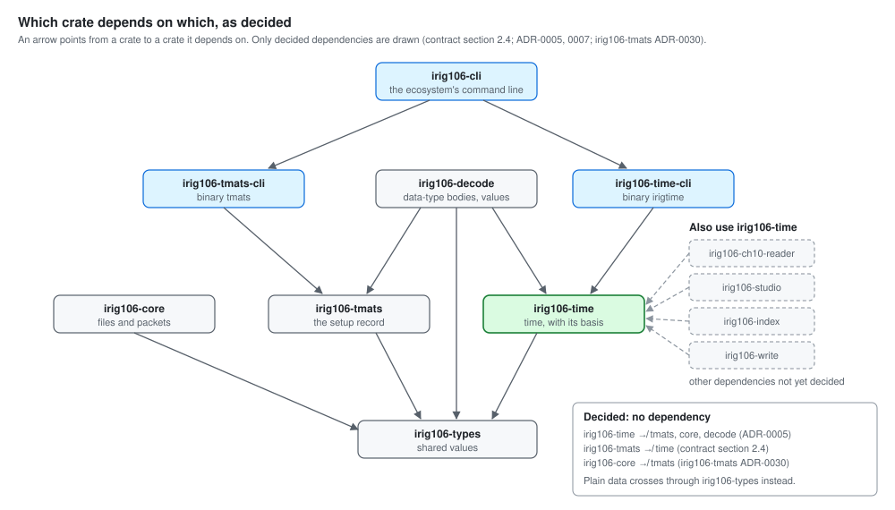
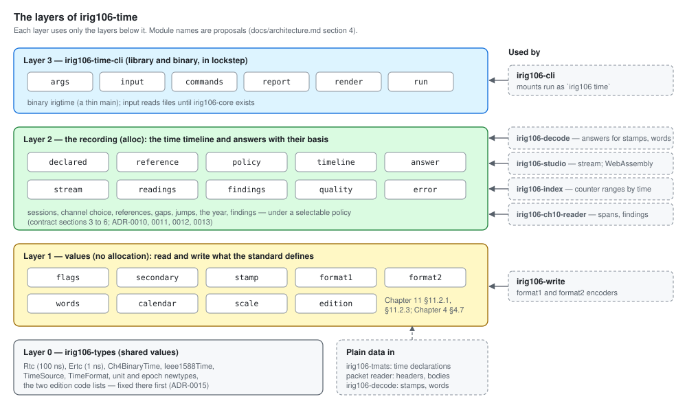
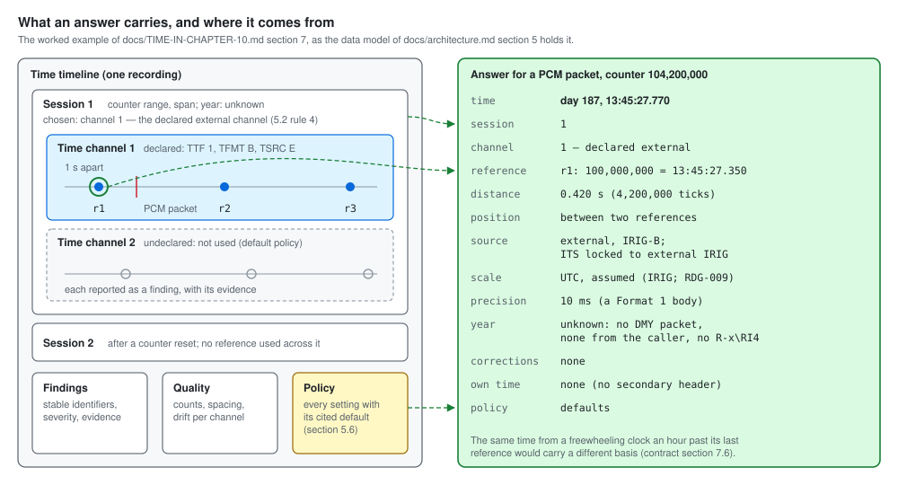
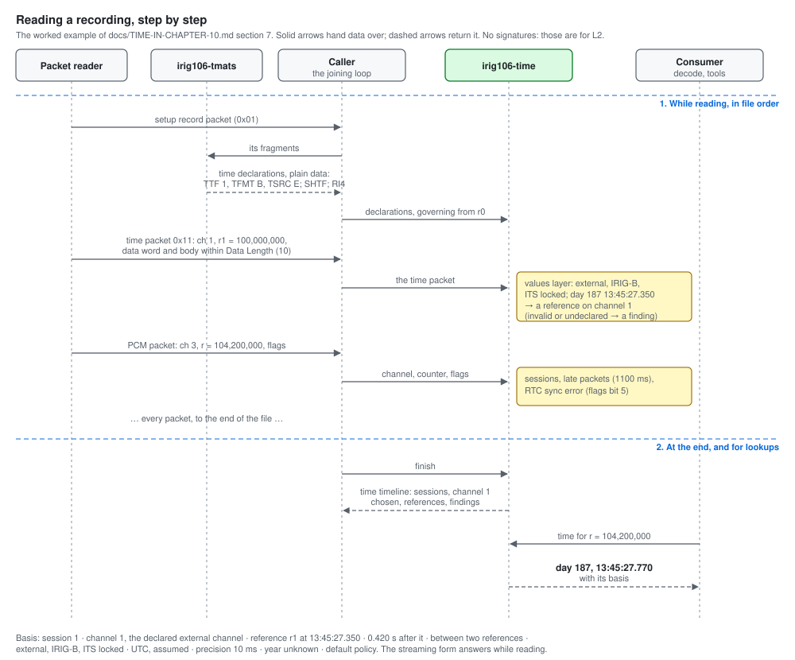
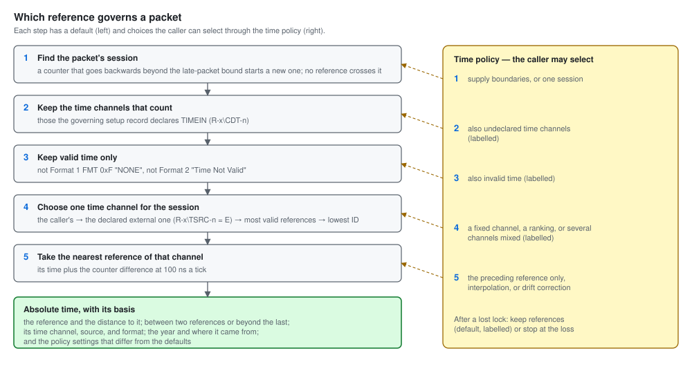
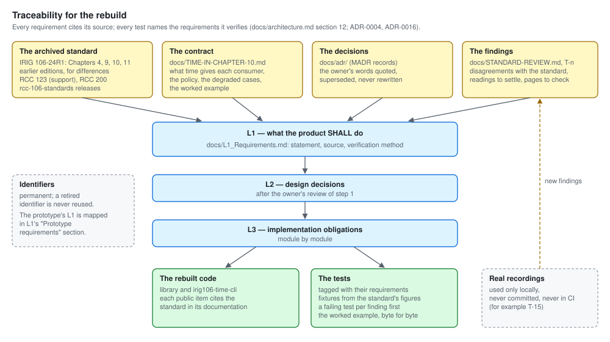

# irig106-time — Architecture

> **Status: proposal for the owner's review** (step 1 of the plan,
> `docs/TIME-IN-CHAPTER-10.md` section 8.2). Revised on 2026-09-27 against
> the contract document `docs/TIME-IN-CHAPTER-10.md`; it replaces the
> prototype's architecture (written for 0.1.0 on 2026-03-25, kept at the tag
> `prototype-0`). Decisions are in `docs/adr/` (ADR-0001 to ADR-0017); each
> section names the records it rests on. Rules cite the archived standard
> (`TelemetryWorks/rcc-106-standards`, 106-24R1 unless stated). Nothing here
> is code yet: type and module names are proposals, and signatures are left
> to L2 and L3.

## Contents

1. What the crate is for
2. Principles
3. The crate in the ecosystem
4. The layers and modules
5. The data model
6. How a recording is read
7. How a recording is produced
8. Errors and findings
9. Features, targets, and dependencies
10. The workspace and the CLI
11. From the prototype to the rebuild
12. Traceability and tests
13. Open points for the review

---

## 1. What the crate is for

Every Chapter 10 packet carries a relative time counter — "a free-running
10-MHz binary counter represented by 48 bits that are common to all data
channels" that "shall remain free-running during each session (e.g.,
recording)" (Chapter 11 §11.2.1.1 i). Absolute time arrives separately: in
time packets that pair it with a counter value at least once a second
(§11.2.3.2, §11.2.3.3), in secondary headers and intra-packet time stamps
(§11.2.1.2, §11.2.1.3 b), and in time words inside data (Chapter 4 §4.7).
The setup record declares where it is (`R-x\TTF-n`, `R-x\TFMT-n`,
`R-x\TSRC-n`, `R-x\SHTF-n`).

**`irig106-time` is the one place in the ecosystem where time is understood**
(contract section 1.2). It reads and writes the standard's time values, and
from a recording's time packets it builds a **time timeline** that turns any
counter value, secondary-header time, time stamp, or time word into absolute
time **with its basis** — which session, which time channel and reference,
how far away, from which source, with which year, under which policy.

What it does not do (contract section 1.3): open files or walk packets (the
packet reader, `irig106-core`); read TMATS (`irig106-tmats`); find time
stamps and time words in data bodies (`irig106-decode`); assemble packets
(`irig106-write`); present time (the tools).

---

## 2. Principles

| # | Principle | Record |
|---|-----------|--------|
| 1 | **Cite the standard.** Every rule traces to a section, figure, or table of 106-24R1; edition differences name both editions. | ADR-0004 |
| 2 | **A leaf library.** Depends only on `irig106-types`; everything else arrives as plain data. | ADR-0005 |
| 3 | **No I/O.** Bytes and values in, values out; the same input gives the same answer everywhere. | ADR-0006 |
| 4 | **An answer, not a time.** Every absolute time carries its basis. | ADR-0011 |
| 5 | **A policy, not hidden rules.** Every rule of time over a recording is a setting with a cited default, and every answer records the policy it used. | ADR-0010 |
| 6 | **Findings, not repairs.** Degraded time is reported with a stable identifier; nothing is silently corrected. | ADR-0013 |
| 7 | **Readings are reviewed.** Where TMATS and the packets name things differently, the reading is a register entry. | ADR-0012 |
| 8 | **Small and portable.** `no_std` with `alloc`; builds for WebAssembly. | ADR-0014 |
| 9 | **Tests from the standard.** Fixtures from the standard's figures; a failing test before each fix. | ADR-0016 |

---

## 3. The crate in the ecosystem

*Two directions* (contract section 2). Reading: the packet reader gives
packets; `irig106-tmats` gives the time declarations of each setup record as
plain data; time packets become references; every other packet's counter,
secondary-header time, time stamps, and time words become absolute time for
the decoder and the tools. Producing: the crate encodes time packet data
words and bodies for `irig106-write`.

| Crate | Depends on | Does not depend on |
|-------|-----------|--------------------|
| `irig106-time` | `irig106-types` | `irig106-tmats`, `irig106-core`, `irig106-decode` |
| `irig106-time-cli` | `irig106-time` (`=X.Y.Z`), `irig106-types` | — |
| `irig106-decode` | `irig106-types`, `irig106-tmats`, `irig106-time` | — |
| `irig106-cli` | `irig106-time-cli` (and the other CLI libraries) | — |

*Decided dependencies only.* An arrow points to a crate depended on; the
tools on the right use this crate, and their other dependencies are not yet
decided. The legend lists the dependencies decided against.

What crosses each boundary is contract section 2.3 (A to H). Two of those
boundaries are new types in this crate: the **time declarations** (C), which
the caller fills from `irig106-tmats`'s plain data, and the **answer** (F),
which carries its basis.

---

## 4. The layers and modules

*Three layers.* Values (no allocation) read and write what the standard
defines, one field at a time; the recording layer (with `alloc`) builds the
time timeline and answers questions against it; the CLI library and its
binary sit on top. `irig106-types` holds the shared values underneath.

### 4.1 Layer 0 — `irig106-types` (shared values)

The counter (`Rtc`, 48 bits, 100 ns a tick), the ERTC (64 bits, **1 ns a
tick**, "RTC = ERTC/100", §11.2.1.1 g; T-5), the Chapter 4 and IEEE 1588
time values, the time sources and formats (with source 3 reserved, T-6, and
FMT `0xF` NONE, T-7), the unit and epoch newtypes, and the two edition code
lists — the packet header's data type version and the setup record's RCCVER
(T-9). Fixed there first (ADR-0015).

### 4.2 Layer 1 — values (no allocation)

| Module | Holds | Standard | Findings fixed |
|--------|-------|----------|----------------|
| `flags` | the packet flags' time bits: secondary header present (bit 7), time stamp source (bit 6), secondary-header time format (bits 3–2), RTC sync error (bit 5) | §11.2.1.1 g | T-1 |
| `secondary` | the 12-byte secondary header: 8 bytes of time in the format of bits 3–2 (Figures 11-4 to 11-6), 2 reserved bytes, the checksum and its check | §11.2.1.2 | T-10 (layout to confirm) |
| `stamp` | an 8-byte intra-packet time stamp: the 48-bit counter "plus 16 high-order zero bits", or the 64-bit secondary-header format when bit 6 is set | §11.2.1.3 b | T-1 |
| `format1` | the Format 1 data word (SRC, FMT, leap year, date format, ITS, reserved bits) and bodies: day format, 3 words (6 bytes); day, month, and year, 4 words (8 bytes); decode and encode | §11.2.3.2, Figures 11-12 to 11-14, Table 11-16 | T-6, T-7, T-12 |
| `format2` | the Format 2 data word (NTF bits 7–4, TS bits 3–0, reserved 31–8) and bodies: NTP seconds and fraction, PTP seconds and nanoseconds, 8 bytes each; decode and encode | §11.2.3.3, Figures 11-15 to 11-17 | T-2, T-3 |
| `words` | time words from data: Chapter 4 high, low, and microsecond words, binary or BCD weighted; network time words | Chapter 4 §4.7; contract 3.8 | — (new) |
| `calendar` | absolute time: day of year and time of day to the nanosecond, with an optional year; calendar dates; leap years; the leap second 23:59:60 | Figures 11-13, 11-14; RCC 200-16 §3.6, A.2 | T-16 |
| `scale` | time scales and epochs: UTC (FMT `0x4`, NTP from 1900, "includes leap seconds"), TAI (PTP from 1970, "does not include leap seconds"), GPS (FMT `0x5`, TAI − 19 s), unknown (FMT `0x3`), and IRIG-A, B, G as UTC by assumption; Unix time; conversions between them through the leap-second table, which states the date it is known to be current to | §11.2.3.2 a, §11.2.3.3; RCC 200-16 §1, A.2; RDG-009 | T-17 |
| `edition` | what exists in which edition: Format 2 from 106-17; Chapter 10 section numbers before 106-17, Chapter 11 after | §11.2.1.1 e | T-4 |

Every reader in this layer takes a byte slice bounded by the caller —
never more than Data Length (§11.2.1.1 d; T-12) — checks reserved bits
("All reserved bit fields in packet headers or CSDWs shall be set to zero",
§11.2.1 f), and reports what it cannot read as an error (section 8).

### 4.3 Layer 2 — the recording (with `alloc`)

| Module | Holds | Contract |
|--------|-------|----------|
| `declared` | **time declarations**: for each setup record, the counter range it governs and its time channels (`R-x\TTF-n`, `R-x\TFMT-n`, `R-x\TSRC-n`), each channel's `R-x\SHTF-n`, and the original recording date (`R-x\RI4`) — plain data the caller fills from `irig106-tmats` | 2.3 C, 4.5 |
| `reference` | a **reference**: one time packet as a point — its session, channel, counter, time, scale, source, format, ITS, validity, and the packet it came from | 3.2, 3.3 |
| `policy` | the **time policy**: every setting of contract section 5.6, with its cited default | 5.6; ADR-0010 |
| `timeline` | the **time timeline** and its builder: sessions, time channels and the one chosen per session, references, source changes, gaps, jumps, late packets, the year, the quality measures, and the findings | 5.2 to 5.5 |
| `answer` | the **answer**: an absolute time with its basis; the lookups — time for a counter, a secondary-header time, a time stamp, or a set of time words; the counter range for a span of absolute time | 3.1, 3.4, 3.8, 5.5 |
| `stream` | the same rules with bounded memory, answering as packets pass | 4.8 |
| `readings` | the reading register in code: TMATS letters against packet values, one entry per row of contract 3.7, each naming its register entry | 3.7; ADR-0012 |
| `findings` | findings: stable identifier, default severity, evidence | 6; ADR-0013 |
| `quality` | measures of the references: counts, spacing, drift per channel | 3.5 |
| `error` | errors for input that cannot be read at all | 8 |

### 4.4 Layer 3 — `irig106-time-cli`

A library — `args` (hand-rolled, ADR-0008), `input` (the packet reader until
`irig106-core` exists), `commands`, `report` (a model independent of the
output format), `render` (text, CSV, JSON), `run` — and the binary
`irigtime`; `irig106-cli` mounts `run` as `irig106 time` (ADR-0007). It
writes the joining loop of section 6 once, for every command.

---

## 5. The data model

*The answer and the timeline.* A time timeline holds sessions; each session
has its time channels, the one chosen and why, and each channel's
references. An answer is the absolute time with its basis, drawn from one
reference of the chosen channel, and it records the policy.

### 5.1 The time timeline

| Part | Holds |
|------|-------|
| **Session** | a run of packets whose counter increases, allowing for late packets (default bound 1100 ms); its counter range; its span in absolute time; its chosen time channel and the rule that chose it; its year and where the year came from |
| **Time channel** (per session) | the channel ID; what the governing setup record declares for it (or that it is undeclared); its references; its source changes; its gaps and jumps |
| **Reference** | counter, absolute time, time scale (UTC, TAI, GPS, or unknown; assumed or stated), precision (the resolution of its format: 10 ms for Format 1), source, format, ITS, validity, and the packet it came from; whether it is used, and why not if not |
| **Governing setup record** | per counter range, which time declarations apply (from the caller, after `irig106-tmats` L1-CH10-008) |
| **Findings** | every finding of the recording, each with its evidence |
| **Quality** | reference counts, largest and smallest spacing, references per second, drift in parts per million |
| **Policy** | the policy the timeline was built with |

### 5.2 The answer

| Field | Meaning |
|-------|---------|
| **time** | the absolute time: day of year and time of day to the nanosecond, with the year when known |
| **session** | which session the counter lies in |
| **time channel** | which channel's references were used, and the rule that chose it (the caller, the declared external channel, the most valid references, the lowest ID) |
| **reference** | the reference used: its counter and time |
| **distance** | the counter difference to it, as a duration |
| **position** | between two references; before the first (extrapolated, by policy); beyond the last |
| **source** | the reference's source, format, and ITS (external IRIG-B locked; internal freewheeling; PTP valid) |
| **scale** | the time scale of the answer — UTC, TAI, GPS, or unknown — and whether it is stated by the standard or assumed by the policy |
| **precision** | the resolution of the reference's format (10 ms for Format 1; 1 ns for PTP), so a time is not read as more precise than its reference |
| **year** | known or not, and from where: a day-month-year packet, the caller, `R-x\RI4` |
| **corrections** | drift correction applied or not; leap-second offset applied, and whether the table reaches the date |
| **own time** | for a packet with a secondary header: its own time, and its difference from the counter-derived time when beyond the policy's tolerance |
| **policy** | the policy used, or the settings that differ from the defaults |

The worked example (contract section 7.3) is an answer: day 187
13:45:27.770; session 1; time channel 1, the declared external channel;
reference r1 = 100,000,000 at 13:45:27.350; distance 0.420 s; between two
references; external, IRIG-B, ITS "locked to external IRIG time signal";
UTC, assumed; precision 10 ms; year unknown; defaults.

### 5.3 The policy

The settings and defaults are contract section 5.6: session boundaries;
which time channels count (declared TIMEIN); which time counts (valid only);
choosing the time channel (the caller's, then the declared external, then
the most valid references, then the lowest ID); the reference within the
channel (nearest); after a lost lock (keep, labelled); the year (day-month-
year packet, caller, `R-x\RI4`); reference gap (more than 1 s plus a
tolerance); time jump (the format's resolution, 10 ms for Format 1); the
late-packet bound (1100 ms = the 1000 ms stream commit time plus the 100 ms
packet generation time of Chapter 10 §10.6.1 b–c); counter wrap (arithmetic,
fixed); before the first reference (counter time only); secondary header
against the counter (report beyond the reference's resolution); the time
scale of IRIG-A, B, G (UTC, assumed) and of the real-time clock (unknown);
and the severity of each finding (its default, section 8).

---

## 6. How a recording is read

*The worked example, as a sequence.* While reading, the caller hands this
crate the time declarations, each time packet, and every other packet's
channel, counter, and flags; at the end it receives the time timeline, and
any consumer asks it for answers.

The caller walks the packets in file order — the joining loop of contract
section 4.2 — and feeds the builder three kinds of input.

1. **A setup record** (from `irig106-tmats`, as plain data): its time
   declarations and the counter from which it governs. The declarations
   decide which time channels count (policy: declared TIMEIN).
2. **A time packet** (`0x11`, `0x12`, Table 11-4): its channel, data type,
   counter, data word, and body — bounded by Data Length. Layer 1 reads it;
   the timeline records a reference, or a finding and no reference (invalid
   time, an undeclared channel, malformed bytes).
3. **Every other packet's channel, counter, and flags**: the counter going
   backwards beyond the late-packet bound starts a new session; a late packet
   within the bound is noted; flags bit 5 ("RTC sync error has occurred",
   §11.2.1.1 g) is a finding.

*Which reference governs a packet* (contract section 5.2): sessions first,
declared time channels, valid time, one channel per session, then the
nearest reference — each rule a setting of the policy.

At the end the builder gives the time timeline: sessions, channel choice,
year, gaps, jumps, findings. Lookups against it give answers: for a counter
(any packet), for a secondary-header time (checksum first), for a time stamp
(bit 6 decides whether it is a counter or the secondary-header format), for
a set of time words (from `irig106-decode`).

**One pass or two.** The whole-recording timeline sees every reference
before answering, so "nearest" can look ahead. A caller that must answer as
it reads (`irig106-decode` streaming, `irig106-studio`) uses `stream`: it
holds a packet until the next reference of its channel arrives or the
policy's bound passes, then answers; with the policy "preceding reference
only", it answers at once. Memory is bounded by the late-packet bound and
the reference spacing, not by the recording.

---

## 7. How a recording is produced

`format1` and `format2` encode what they decode: the data word and the body,
byte for byte as Figures 11-12 to 11-17 lay them out, with reserved bits
zero. `irig106-write` packs them into packets and keeps the rules the crate
cannot keep for it: a time packet first after the setup record, at least
once a second, the counter free-running through the session, and "RTC =
ERTC/100" when writing ERTC (contract section 4.11).

---

## 8. Errors and findings

| | Error | Finding |
|---|-------|---------|
| **When** | the input cannot be read at all | the input can be read, and something about time is wrong, missing, weak, or in disagreement |
| **Examples** | a buffer shorter than the figure's length; a BCD digit above 9 | no time packets in a session; a packet before the first reference; FMT `0xF` NONE; time status "Time Not Valid"; reserved bits set; an undeclared time channel; TMATS and the packets differ; a failed secondary-header checksum; mixed secondary-header formats; a gap, jump, reset, or late packet; no year; the leap-year bit disagrees; a stale leap-second table; RTC sync error |
| **Effect** | the value is not produced | the answer is given as the policy says, labelled |
| **Source** | Layer 1 | Layers 1 and 2, gathered in the timeline |

Every finding has a stable identifier, a default severity the caller can
change, and its evidence: the packet (file position when the caller gives
it), the channel, the counter. Identifiers are never reused. Nothing panics
on any input (L1-ERR-001).

**The findings** (proposed identifiers and default severities; L2 fixes
them). *Error*: the value cannot be trusted and is not used; *warning*: the
recording breaks a rule of the standard; *information*: worth knowing,
nothing is wrong.

| ID | Finding | Default | Contract |
|----|---------|---------|----------|
| TF-001 | A session has no time packet | warning | 6.1 |
| TF-002 | A dynamic packet precedes the session's first time packet | warning | 6.2 |
| TF-003 | A time packet is marked invalid (FMT `0xF` NONE; TS "Time Not Valid") | warning | 6.3 |
| TF-004 | A time packet is malformed (a digit above 9, a field out of range, a short body) | error | 6.3 |
| TF-005 | Reserved bits are set (data word, body, secondary header) | warning | 6.3 |
| TF-006 | A reserved value is used (SRC `0x3`–`0xE`, FMT `0x6`–`0xE`, NTF `0x3`–`0xF`, TS `0x2`–`0xF`, ITS `1000`–`1111`, flags bits 3–2 `11`) | warning | 6.3, 6.6 |
| TF-007 | The leap-year bit disagrees with the day or the year | warning | 6.3, 6.8 |
| TF-008 | Time packets on a channel the setup record does not declare TIMEIN | warning | 6.4 |
| TF-009 | A declared time channel carries no time packets | information | 6.4 |
| TF-010 | TMATS and the packets differ (`TTF`, `TFMT`, `SHTF`) | warning | 6.4 |
| TF-011 | A channel's time source differs from `TSRC`, or changes (lock lost or regained) | information | 5.2, 6.4 |
| TF-012 | A secondary header fails its checksum | error | 6.6 |
| TF-013 | Channels use different secondary-header time formats | warning | 6.6 |
| TF-014 | A secondary header's time and the counter's differ beyond the tolerance | warning | 6.6 |
| TF-015 | Packet flags bit 6 is set without bit 7 | error | 6.6 |
| TF-016 | A reference gap | warning | 5.4, 6.7 |
| TF-017 | A time jump | warning | 5.4, 6.7 |
| TF-018 | A counter reset: a new session | information | 5.4, 6.7 |
| TF-019 | A packet later than the late-packet bound | warning | 5.4, 6.7 |
| TF-020 | A session's year is unknown | information | 5.3, 6.8 |
| TF-021 | A conversion falls after the leap-second table's last known date | warning | 6.8 |
| TF-022 | A leap second (23:59:60) was read | information | 3.2, 6.8 |
| TF-023 | A time scale is assumed or unknown | information | 3.2, 6.8 |
| TF-024 | Packet flags report an RTC sync error (bit 5) | warning | 6.7 |
| TF-025 | A packet's ERTC and RTC disagree ("RTC = ERTC/100") | warning | 6.6 |
| TF-026 | A Format 2 time packet in a recording declared before 106-17 | warning | 3.9 |
| TF-027 | Secondary headers satisfy only the other checksum reading (RDG-008) | information | 6.6 |

Weak time (contract 6.5) is not a finding: every answer's basis carries
it.

---

## 9. Features, targets, and dependencies

| | |
|---|---|
| **Dependencies** | `irig106-types` (required); `serde` and `chrono` (optional features) |
| **Features** | `std` (default: `std::error::Error`); `alloc` implied by the recording layer; `serde`; `chrono` (conversions to and from `chrono` types) |
| **Targets** | any Rust target; CI builds `wasm32-unknown-unknown` with and without `serde`, and a `no_std` target without `std` (ADR-0014) |
| **Edition and MSRV** | edition 2024, Rust 1.85 (ADR-0003) |
| **`serde`** | `Serialize` and `Deserialize` for every public value type, answer, finding, policy, and time timeline, so tools can store and exchange them |
| **`chrono`** | conversions between the crate's absolute times and `chrono`'s date-time types, for times whose year and scale are known |
| **Unsafe code** | none (`#![forbid(unsafe_code)]`) |
| **Documentation** | every public item documented (`#![deny(missing_docs)]`), citing the standard; `cargo doc` in CI |
| **Performance** | benchmarks for the hot paths — reading a time packet, answering for a counter, building a time timeline — with the budget set after the first measurement (as `irig106-tmats` L1-PERF-001 does); the prototype's measurements (`docs/benchmark_results.md`) are the baseline to beat |

---

## 10. The workspace and the CLI

One workspace, two crates, one version (ADR-0007): `irig106-time` and
`irig106-time-cli`, published together; the CLI pins the library with
`=X.Y.Z`. The layout follows `irig106-tmats`'s decision on W1 to W3 (a
virtual workspace with `crates/`), so the repositories look alike. The CLI's
commands are `summary`, `channels`, `jumps`, `timeline`, `csv`, and
`correlate`, each presenting what the library answers, with the basis and
the findings; network time is reported as itself, never as GPS (ROADMAP
P6-10).

---

## 11. From the prototype to the rebuild

The prototype (`prototype-0`) is not patched (ADR-0001); what it got right is
carried over through tests written from the standard (ADR-0016).

| Prototype module | In the rebuild | Findings |
|------------------|----------------|----------|
| `rtc` (from `irig106-types`) | Layer 0, unchanged | — |
| `absolute` | `calendar`; Chapter 4 binary time to `secondary` and `words` after the page check; day 0 reported, not turned into day 1; the leap second accepted | T-10, T-16 |
| `bcd` | `format1` bodies, 6 and 8 bytes; digit and range checks kept | T-12 |
| `csdw` | `format1` data word, with ITS, NONE, reserved bits, source 3 reserved | T-6, T-7 |
| `network_time` | `format2` (data word NTF and TS; 8-byte PTP body; from 106-17) and `scale` (UTC, TAI, GPS, unknown; leap-second table, with its currency) | T-2, T-3, T-4, T-17 |
| `secondary` | `secondary`; mixed formats reported | T-10 |
| `intra_packet` | `flags` and `stamp`, bit 6 and bits 3–2 | T-1 |
| `correlation` | `timeline` and `answer`: the nearest-reference core kept, with sessions, channel choice, policy, basis, findings; late packets bounded at 1100 ms by default (the prototype uses 2 s) | — |
| `streaming` | `stream`, same policy and basis | — |
| `quality` | `quality`, feeding the basis | — |
| `version` | the mappings move to `irig106-types`; `0x0F` unknown; `edition` keeps what changes for time | T-9 |
| `packet_standard` | `edition` | — |
| `recording_event` | leaves the crate, for `irig106-decode` (ADR-0009) | T-8 |
| `error`, `util`, `chrono_interop` | `error`; `util` as needed; `chrono` feature | — |
| `irig106-time-cli/src/main.rs` | `irig106-time-cli` library and `irigtime` binary | P6-10 |

---

## 12. Traceability and tests

*Four sources, one chain.* The standard, the contract, the decisions, and
the findings feed L1; L2 and L3 follow the review; the code implements L3
and the tests verify it; real recordings, used only locally, feed new
findings back.

Each L1 requirement cites the standard or an ADR; L2 and L3 name their
parents; each test names the requirements it verifies with a
`/// Requirements: L?-XXX-NNN` doc comment above `#[test]`, and each reading
it pins with `/// Interpretations: RDG-NNN`. `scripts/build-trace-matrix.py`
(adapted from `irig106-tmats`) generates `docs/TRACE-MATRIX.md` from the
requirement documents, the reading register (`docs/INTERPRETATIONS.md`), and
those markers; a CI job fails when the matrix is out of date. A requirement
verified by Inspection, Analysis, or Demonstration names its artifact on an
**Evidence** line, or it stays Draft. The prototype's
requirement identifiers that survive keep their numbers; those that were
wrong are retired and never reused (L1, section "Prototype requirements").

---

## 13. Open points for the review

1. ~~ADR-0011, 0012, 0013, 0014, 0016, 0017~~ — **accepted** (2026-09-27).
   0.1.0 to 0.7.0 are not yanked (owner, 2026-09-27).
2. **The finding identifiers and default severities** of section 8
   (TF-001 to TF-027): proposed; L2 fixes them.
3. ~~RTC sync error as a finding~~ — now in the contract (section 6.7) and
   TF-024.
4. **T-10**, the Chapter 4 binary layout: Figure 11-4 as extracted places
   the microsecond word above a reserved half in the first long word, and the
   high-order word above the low-order word in the second; the page image,
   and Chapter 4 Figure 4-4, still need checking before `secondary` and
   `words` are specified in L2.
5. **The one-pass answer** (section 6): whether `stream` holds packets until
   the next reference by default, or answers at once from the preceding
   reference.
6. **The reading register** (`docs/INTERPRETATIONS.md`, RDG-001 to RDG-011):
   every entry awaits review. RDG-003 (`TFMT` I "Internal") is open;
   RDG-007 (ITS before 106-17, T-14) and RDG-008 (the checksum, T-15,
   suspect) change what L2 specifies; RDG-009 (time scales, T-17) and
   RDG-010 (the leap second, T-16) were added at the completeness check.
7. **Page checks** before L2: Figures 11-4 and 4-4 (T-10), and whether
   "Default: A" in Table 9-4 belongs to `R-x\TFMT-n` (RDG-002).
